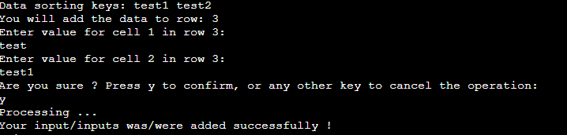

# Inventory Management 

## Site overview

The "Inventory Management" project was created to help small companies keep track of their assets or for individuals who want to keep the information structured and organised. The application was built on Google Sheets API and Google Drive API to accommodate userbase actions, like adding, removing or modifying data. 


## Table of contents
1. [Site overview](#site-overview)
1. [User experience (UX)](#user-experience-ux)
1. [Features](#features)
    * [Future Development & Features Left to Implement](#future-development--features-left-to-implement)
1. [Logical flow](#logical-flow)
    * [Main menu logic chart](#main-menu-logic-chart)
    * [Logic chart of setting an active worksheet](#logic-chart-of-setting-an-active-worksheet)
    * [Logic chart of adding a worksheet](#logic-chart-of-adding-a-worksheet)
    * [Logic chart of deleting a worksheet](#logic-chart-of-deleting-a-worksheet)
    * [Logic chart of duplicating a worksheet](#logic-chart-of-duplicating-a-worksheet)
    * [Logic chart of Printing worksheet content](#logic-chart-of-printing-worksheet-content)
    * [Logic chart of Clearing a worksheet](#logic-chart-of-clearing-a-worksheet)
    * [Logic chart of Adding Data sorting keys](#logic-chart-of-adding-data-sorting-keys)
    * [Logic chart of Adding row of data](#logic-chart-of-adding-row-of-data)
    * [Logic chart of modifying a single cell](#logic-chart-of-modifying-a-single-cell)
    * [Logic chart of modifying a single row](#logic-chart-of-modifying-a-single-row)
    * [Help menu logic chart](#help-menu-logic-chart)
1. [Libraries & Technology Used](#libraries--technology-used)
    * [Built-in Python Libraries](#built-in-python-libraries)
    * [Other](#other)
1. [Testing](#testing)
    * [Functional testing](#functional-testing)
    * [PEP8 Validation](#pep8-validation)
1. [Deployment](#deployment)
    * [Version control](#version-control)
    * [Clone the repository locally](#clone-the-repository-locally)
    * [Virtual Environment](#virtual-environment)
    * [Google Drive API and Google Sheets API Setup](#google-drive-api-and-google-sheets-api-setup)
    * [Heroku deployment](#heroku-deployment)
1. [Credits](#credits)


## User Experience (UX)
User stories:
Target audience - people who want to automate storing records of their inventory, activities or other forms of data in the terminal-based application

As a User, I want to:
* manipulate the file in such a way that I can add my worksheet, rename, copy or delete it
* get insight into the worksheet contents by printing it into the terminal
* keep my data in an organised structure
* being able to add, remove, or modify single or multiple records

## Features

* Main menu

    * guides a user through available options
* Set active worksheet

    * allows a user to choose a worksheet that he wants to work with in the given moment
* Add worksheet

    * allows a user to add their own worksheets
    * 6 columns and 200 rows are given to user disposal per worksheet
* Rename worksheet

    * allows a user to rename each worksheet, besides the template one
* Duplicate worksheet

    * allows a user to make a copy of chosen worksheet 
* Clear worksheet

    * allows a user to remove all content from a worksheet by using single option from the main menu 
* Print worksheet content

    * Table-like representation of data in worksheet
* Add data sorting keys

    * allows a user to set first row in a worksheet 
    * users can change them as they see fit
* Add a row of data

    * simple and fastest way to add row of data to a worksheet
    * entries to a row are dictated by number of data sorting keys
    * next free row in a worksheet will be used to add user inputs to a worksheet
* Modify single cell

    * more complicated way to edit records in a worksheet
    * to help user, worksheet-like environment was implemented
* Modify single row

    * allows to change whole row in a worksheet
    * to help user, worksheet-like environment was implemented
    * entries to a row are dictated by number of data sorting keys
* Help menu

    * explains basic concepts of each feature to users

### Future Development & Features Left to Implement
* Fully fledged account system
* Data filtering by parameters chosen by a user. (System was scrapped due to time constraints)
* Support for mathematical operations
* Styling the worksheet like alignment, a colour
* Export to pdf functionality

[Back to Table of contents](#table-of-contents)
## Logical flow

### Main menu logic chart


### Logic chart of setting an active worksheet


### Logic chart of adding a worksheet


### Logic chart of deleting a worksheet


### Logic chart of duplicating a worksheet


### Logic chart of Printing worksheet content


### Logic chart of Clearing a worksheet


### Logic chart of Adding Data sorting keys


### Logic chart of Adding row of data


### Logic chart of modifying a single cell


### Logic chart of modifying a single row


### Help menu logic chart


[Back to Table of contents](#table-of-contents)
## Libraries & Technology Used

### Built-in Python Libraries

time
* .sleep() function was used to suspend the execution of the program for a number of seconds. Its primary purpose was to allow users to read messages in a reasonable timeframe.

### Other

Tabulate

* 1-dimensional table to print a worksheet content with data sorting keys as headers

Pandas

* 2-dimensional table to simulate worksheet environment with columns and rows symbols
* Helping a user with assessing a field which they want to change in a worksheet

Google Sheets API and Google Drive API

* connect the application and managing data in worksheets

Lucid Charts

* creation of logical flow charts

OBS Studio and ezgif.com

* recording and creating a gif for the readme

[Back to Table of contents](#table-of-contents)

## Testing

### Functional testing


[Back to Table of contents](#table-of-contents)
### PEP8 Validation

The code used in this project was checked in the PEP8 validator, and all discovered issues were fixed.

## Deployment

### Version Control 

The website was created in Virtual Studio Code editor, and changes were pushed to the GitHub repository https://github.com/bartoszgebarowski/inventory-management by using bash terminal. 

The following commands were used:

```git status``` - This command was used to check files staged and not staged for commit

```git add <file.extension>``` -  This command was used to add changes in file/files, with particular names and extensions, to be staged for commit

```git add .``` - This command was used to add changes in all files, regardless of name and extension, to be staged for commit

```git commit -m "commit message"``` - This command was used to commit all staged changes to a local repository

```git push``` - This command was used to upload all committed locally changes to a GitHub repository

### Clone the Repository locally 

* Click the Code button
* Navigate to the HTTPS tab
* Click the clipboard copy icon (message "Copied" should appear instead of the icon)
* Choose the IDE with git bash support
* Use command ```git clone copied-url``` into bash terminal

[Back to Table of contents](#table-of-contents)

### Virtual Environment 

Virtual environment tool was used to ensure that project would use only required dependencies. It keeps the project separated from global python environment.

The following commands were used:

```python - m venv example_folder``` - This command was used to create virtual environment

```source venv_example_folder/Scripts/activate``` - This command was used to activate virtual environment

### Google Drive API and Google Sheets API Setup
1. Navigate to [Google Cloud Website](https://console.cloud.google.com/)
1. From the dropdown menu, select New Project and pick a name for a project.
1. Select your new project as an active project to work with it
1. Click on the burger icon to open the Navigation menu, choose API & Services, and click Library.
1. Search for Google Drive API and then click Enable button
1. Navigate to Enabled Api & Services and then select Google Drive API
1. Click on Create Credentials button to bring up the form to fill.
1. In the field "Which API are you using?" - choose Google Drive API
1. In the field "What data will you be accessing" - pick Application Data.
1. On the questions "Are you planning to use this API with Compute Engine, Kubernetes Engine, App Engine or Cloud Functions" - select No, I'm not using them.
1. Service Account name - pick a name, click Create and then click on the Continue button.
1. In the field "Grant this service account access to the project" - from the dropdown menu, select Basic -> Editor and then click the Continue button
1. Leave the rest of the fields blank and then click Done.
1. Click on created credentials in the Service Accounts sections and then navigate to the Keys tab.
1. Click on the Add Key button.
1. Click on the Create new Key and choose JSON from the key type option to download it to the hard drive.
1. Click on the burger icon to open the Navigation menu, choose API & Services, and click Library.
1. Search for Google Sheets API and then click Enable button

### Heroku Deployment
1. Navigate to Heroku website. Create an account or sign in to an existing account.
1. Click Create New App button
1. Choose a unique name for your application.
1. Open the "Settings" tab
1. Navigate to Config Vars section, and add the following variables: 
1. Key: PORT, value: 8000
1. Key: CREDS, value: the content of file_with_credentials.json that will allow an application to access Google Sheets API
1. Navigate to the Buildpacks section and add Python and NodeJS(in that order)
1. Navigate to the Deploy tab and connect the Heroku to Github
1. Choose your Github repository and branch from which application will be build
1. Choose a method of deployment(Automatic or Manual) and click Deploy branch button

[Back to Table of contents](#table-of-contents)

## Credits

Honourable mentions:
Code Institute - python essentials template, used in this project
Daisy McGirr - mentor of the Code Institute, whose guidance was invaluable 
Tobiasz Chodarewicz - a friend whose explanation of various code-related issues allowed me to tackle problems that I have encountered during the development process
You - for visiting my Repository and reading the documentation

[Back to Table of contents](#table-of-contents)